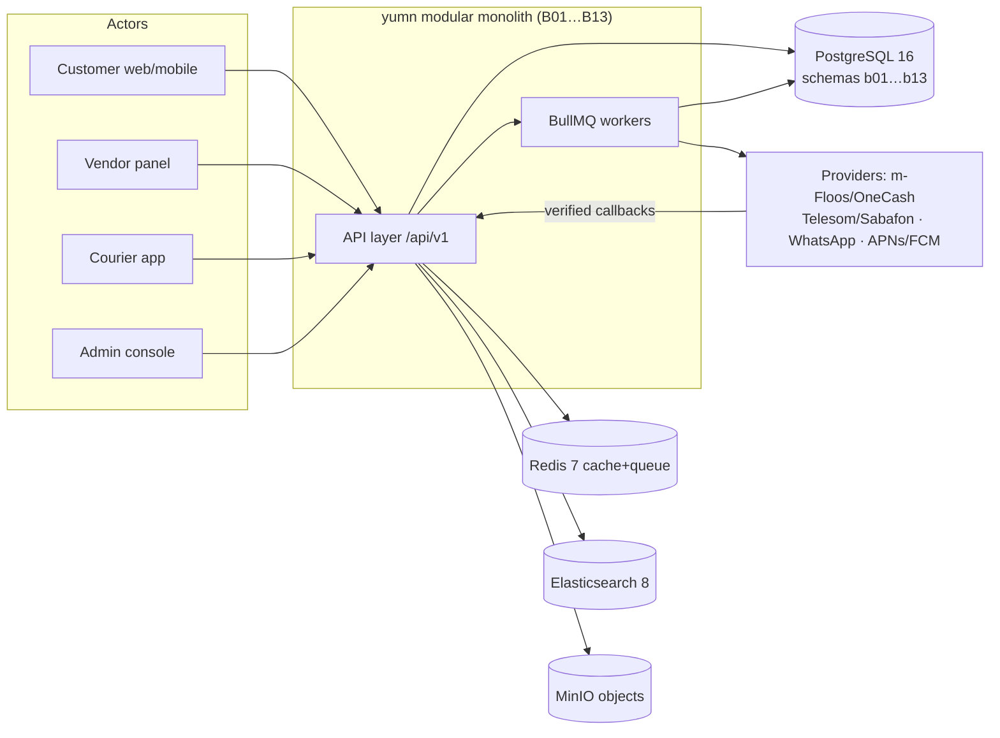

# Data Flow Diagram (with DB transactions) — analysis phase

## Purpose
CORE-03 item 6: the phase-level DFD including the DB transactions each flow performs. Canonical detail: [`../../03-system-analysis/core/data-flow.md`](../../03-system-analysis/core/data-flow.md) (analysis view) and [`../../04-architecture/core/data-flow.md`](../../04-architecture/core/data-flow.md) (consumer/queue view, 30-row register pointer).

## Scope
External entities → processes → data stores for all v1 journeys; transaction boundaries that must be atomic.

## Actors / roles
Actors as in [use-cases.md](use-cases.md); system participants: NestJS modules `B01…B13`, BullMQ workers, PostgreSQL, Redis, Elasticsearch, MinIO, providers (m-Floos/OneCash, Telesom/Sabafon, WhatsApp, APNs/FCM).

## Main flow (context DFD)

## DB transactions that must be atomic (invariants)

| Transaction | Writes (single unit) | Invariant | Rule |
|---|---|---|---|
| Checkout | `order` + `sub_order`(s) + `order_item` + stock deduction + `payment` + `wallet_transaction` + ledger rows | master total = Σ sub-totals; stock never negative; wallet never negative; ledger Σ = 0 | `ORD-02`, `STK-01`, `MNY-03/05` |
| Order create | order rows + idempotency record | duplicate POST returns original `order_no` | `ORD-03`, `MNY-06` |
| Top-up credit | `wallet_transaction` + ledger rows (only on verified callback/admin verification) | never from client claim | `MNY-07` |
| Escrow release | `escrow` + commission + ledger rows + payout candidate | refund draws escrow first, then vendor payable | `ESC-02/03` |
| Delivery confirm | `shipment` code-hash check + `order` state + `order_status_history` | `DELIVERED` only via 6-digit code | `ORD-04`, `SHP-03` |
| Refund | `return_request` + wallet credit + commission reversal | ≤3 business days, wallet-only | `MNY-10`, `RET-03` |

**Append-only stores:** `wallet_transaction`, `order_status_history`, `audit_log` — no UPDATE/DELETE, corrections are compensating `ADJUSTMENT` rows (`MNY-04`, `DATA-REQ-007`).

## Alternate flows
ES down → search falls back/degrades but browse works (`NFR-007`); provider callback fail → poll + reconcile (`ESC-05`); queue retry ×3 → DLQ + alert ≤1 min.

## Exception flows
Any violated invariant aborts the transaction (no partial ledger) and surfaces the closed error catalog code (`API-03`).

## Postconditions
Consistent state across wallet/order/escrow/stock; every mutation auditable (`audit_log`, `LOG-01`).

## Data entities touched
All 18 entities: [`08-database/`](../../08-database/entities-index.md) (`DB-001…DB-018`).

## Open questions (COM-01)
1. `D-07`: API promises storage with no entity (push devices, review reports, dispute evidence, ticket messages, vendor application, top-up proof, payout account, deletion request) — add entities or remove endpoints before implementation.

## Change History

| Date | Version | Change | Author |
|---|---|---|---|
| 2026-09-28 | 1.0 | Initial creation (CORE-03 item 6, session 005) | analysis-agent |
