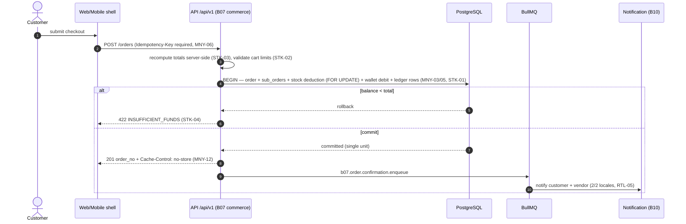
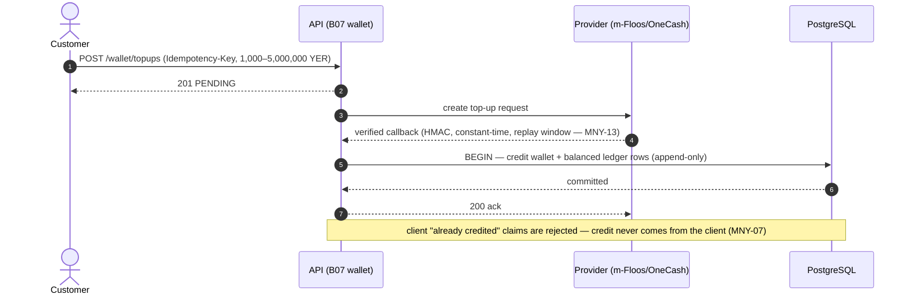

# Sequence Diagrams — analysis phase

## Purpose
CORE-03 item 11 (separate file): interaction sequences for the phase's functionality, as Mermaid. Canonical detailed flows: [`03-system-analysis/sequence-flows.md`](../../03-system-analysis/sequence-flows.md) (`SQ-01`…`SQ-05`); this file holds the phase-level diagrams and indexes them.

## Scope
Cross-actor, cross-layer interactions spanning API → domain → repository → queue → external providers.

## Index

| ID | Sequence | Canonical detail |
|---|---|---|
| `SQ-01` | Browse → cart → checkout → order → delivery → completion | `sequence-flows.md` §SQ-01 |
| `SQ-02` | Return flow | §SQ-02 |
| `SQ-03` | Vendor onboarding (KYC) | §SQ-03 |
| `SQ-04` | Wallet top-up (provider callback + bank-transfer admin verification) | §SQ-04 |
| `SQ-05` | Dispute (escrow freeze → resolution) | §SQ-05 |

## Representative sequence — checkout with wallet payment (`WF-003`, `SQ-01` head)

## Representative sequence — wallet top-up credit (`MNY-07`, `WF-009`)

## Invariants visible in every sequence
`Idempotency-Key` on money/order endpoints (`MNY-06`, `API-05`) · `Cache-Control: no-store` on money/order/session (`MNY-12`) · server-side authorization (`IDT-05`) · errors from the closed catalog in both locales (`API-03`).

## Open questions (COM-01)
1. Bank-transfer top-up verification path (admin, `UC-034`) needs its own sequence before implementation — `SEC-005`/`WF-009` cover the provider path only.

## Change History

| Date | Version | Change | Author |
|---|---|---|---|
| 2026-09-28 | 1.0 | Initial creation (CORE-03 item 11, session 005) | analysis-agent |
