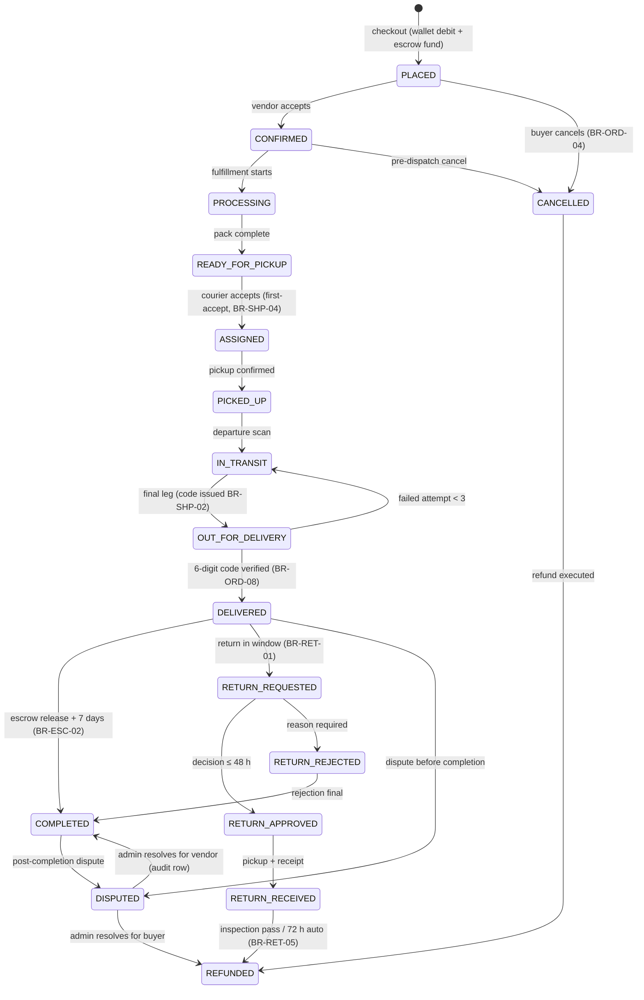

# State Machines — analysis phase

## Purpose
CORE-03 item 10: zero-to-end states, transitions, data. Canonical, authoritative tables live in [`../../03-system-analysis/core/state-transitions.md`](../../03-system-analysis/core/state-transitions.md) — **17 order states** (`C-09`, `ORD-01`); this artifact rolls them up and records the machine inventory.

## Scope
All persisted state machines in the design: order lifecycle (17 states), escrow, payment, return, dispute, KYC, wallet transaction types, coupon, shipment attempts, notification delivery.

## The order state machine (roll-up — canonical detail is the linked file)

| # | State | Category | # | State | Category |
|---|---|---|---|---|---|
| 1 | `PLACED` | Active | 10 | `COMPLETED` | Terminal |
| 2 | `CONFIRMED` | Active | 11 | `CANCELLED` | Terminal* |
| 3 | `PROCESSING` | Active | 12 | `RETURN_REQUESTED` | Return |
| 4 | `READY_FOR_PICKUP` | Active | 13 | `RETURN_APPROVED` | Return |
| 5 | `ASSIGNED` | Active | 14 | `RETURN_REJECTED` | Return |
| 6 | `PICKED_UP` | Active | 15 | `RETURN_RECEIVED` | Return |
| 7 | `IN_TRANSIT` | Active | 16 | `REFUNDED` | Terminal |
| 8 | `OUT_FOR_DELIVERY` | Active | 17 | `DISPUTED` | Exception |
| 9 | `DELIVERED` | Settling | | | |

## Invariants
- Any transition not in the canonical table ⇒ **`409 STATE_CONFLICT`, never 500** (`ORD-01`, `TST-CON-09`).
- `DELIVERED` reachable **only** via 6-digit code (`ORD-04`, `C-16`).
- Concurrent transitions: optimistic `version` locking, loser gets `409` (`ORD-07`).
- Every change appends `order_status_history` with actor/time/reason (`ORD-05`).
- Escrow freezes only the disputed sub-orders (`ESC-06`).

## Data entities touched
`order`, `sub_order`, `order_status_history`, `escrow`, `payment`, `return_request`, `shipment`, `wallet_transaction`, `user` (KYC).

## Open questions (COM-01)
1. **`ORD-08` / defect `D-12`:** precedence when `COMPLETED → RETURN_REQUESTED` races `COMPLETED → DISPUTED` is **unspecified** — an ADR + transition row are required **before** implementing that path; do not invent the rule in code.

## Change History

| Date | Version | Change | Author |
|---|---|---|---|
| 2026-09-28 | 1.0 | Initial creation (CORE-03 item 10, session 005) | analysis-agent |
